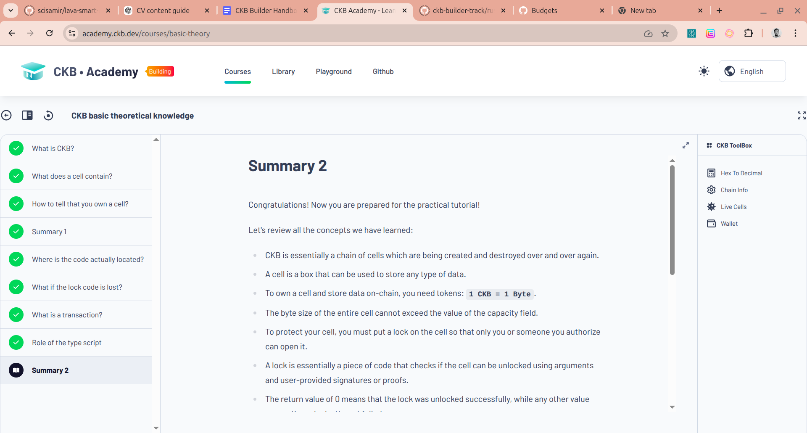
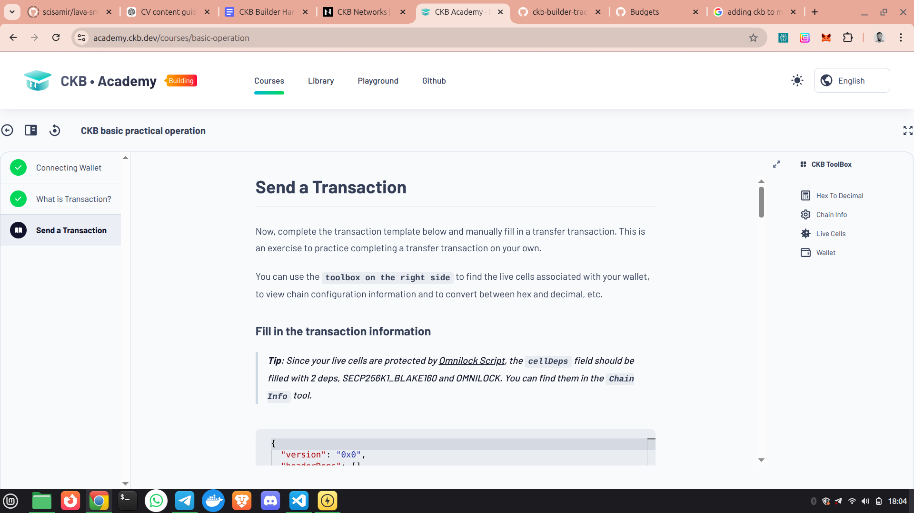

# Weekly Status Report

**Name:** Yahaya Abdulrauf

---

## 📚 Academy Courses / Lessons Completed

- **Lesson 1:** CKB Basic Theoretical Knowledge ✅  
- **Lesson 2:** CKB Practical Operations ✅  

- **In Progress:** Introduction to Scripts 🚧  

---

## 🧠 Key Topics Covered

- CKB Fundamentals  
- What Makes CKB Unique  
- Comparison: Bitcoin (BTC) vs Nervos CKB  
- The Cell Model  
- How CKB Works  
- CKB Networks and RPCs  
- **In Progress:** Introduction to Scripts 🚧  

---

## 🛠 Practical Work Completed

- Cloned CKB repository and explored project structure  
- Successfully ran applications using **offckb**, including:

  - Simple Transfer  
  - Simple Lock  
  - xUDT (User Defined Token)  
  - Store Data on Cell  
  - Create DOB  

---

## 📊 Scores Achieved

- Lesson 1: Completed  
- Lesson 2: Completed  

---

## 💡 Key Learnings

- Gained a solid understanding of the **Cell Model**, which differs from the UTXO model by allowing flexible data storage and programmability.  
- Learned how CKB enables more complex logic through scripts and cell structures.  
- Understood the architectural differences between **Bitcoin and CKB**, especially in terms of scalability and programmability.  
- Developed hands-on experience running CKB applications using **offckb**, improving practical familiarity with the ecosystem.  
- Gained insight into how CKB networks operate and how RPCs are used for communication.

---

## 📸 Reference Images

