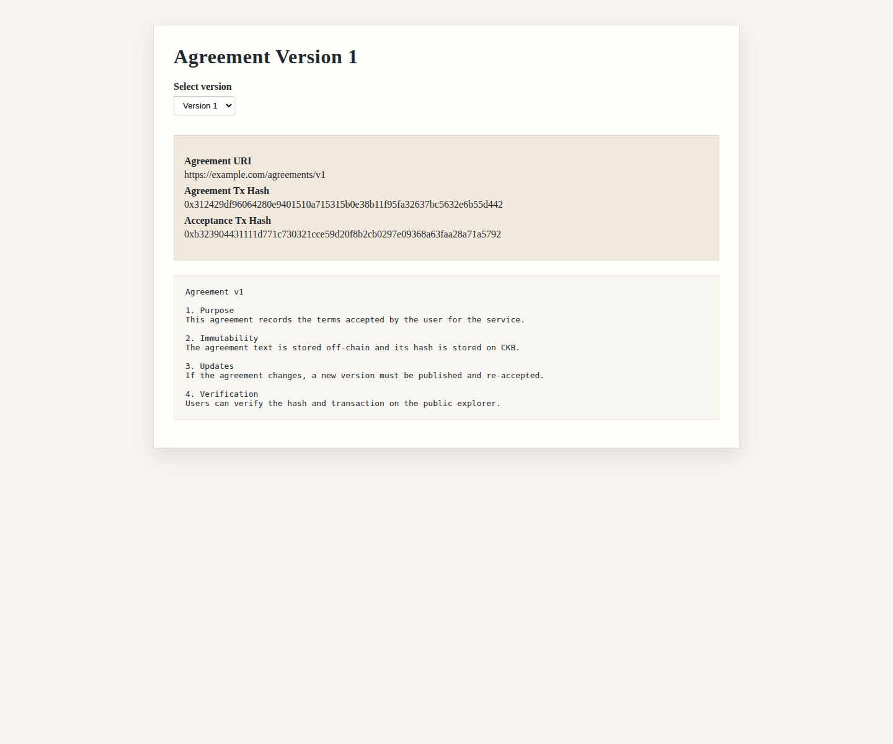
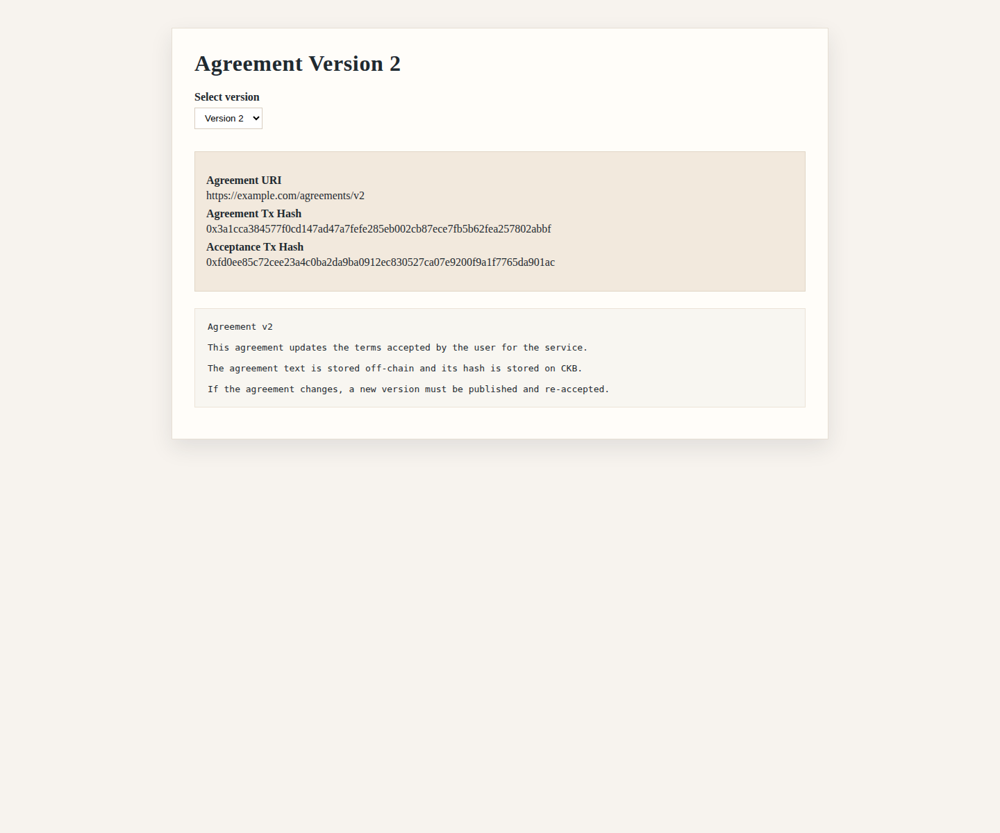

## Week 10 — Week 9 Fix Verified (Built-in Indexer + Acceptance Redeploy)

### Courses / Lessons Completed

* None this week

---

### Key Topics Covered

#### Devnet RPC + Indexer Fix

* Confirmed the local `offckb` devnet was already exposing a working proxy RPC on `http://127.0.0.1:28114`
* Verified that the same endpoint supports both normal RPC calls and CCC indexer-backed calls such as `get_cells`
* Replaced the broken separate indexer dependency with the working built-in/proxied path

#### Acceptance Script Upgrade

* Confirmed the previously deployed acceptance script was still the older version
* Refreshed the stripped acceptance binary from the newer Rust build
* Redeployed the updated acceptance script so metadata-bearing acceptance data would validate

#### Agreement Flow Re-Verification

* Re-ran agreement publish + acceptance for v1 on the fixed environment
* Re-ran agreement publish + acceptance for v2 with auto-resolved previous out-point
* Verified single-acceptance metadata and batch acceptances with unique metadata entries

#### Viewer Evidence

* Updated the JSON agreement registry with real tx hashes
* Captured fresh viewer screenshots for agreement versions 1 and 2

---

### Practical Work Completed

* Updated CCC local config to use `28114` for both `CKB_RPC_URL` and `CKB_INDEXER_URL`
* Confirmed `get_cells` works through the local offckb proxy
* Redeployed updated `agreement-acceptance-type`:

  * Acceptance deploy tx: `0x60275ac71b4ad87990fd2e7e530900b2c8d17bc33765807cf92cc82f70a53d64`

* Re-ran agreement flows on devnet:

  * Agreement publish tx (v1): `0x312429df96064280e9401510a715315b0e38b11f95fa32637bc5632e6b55d442`
  * Acceptance tx (v1): `0xb323904431111d771c730321cce59d20f8b2cb0297e09368a63faa28a71a5792`
  * Agreement publish tx (v2): `0x3a1cca384577f0cd147ad47a7fefe285eb002cb87ece7fb5b62fea257802abbf`
  * Acceptance tx (v2, single metadata): `0xfd0ee85c72cee23a4c0ba2da9ba0912ec830527ca07e9200f9a1f7765da901ac`
  * Acceptance tx (v2, batch metadata x3): `0xd8cd0adbdbbb94cda936bac2fbe05a00e206f31e881a6b226cc7fbe0a30089f4`

---

### Issues Encountered (Why They Came Up)

* **Week 9 environment issue**: the local setup was pointing CCC at a separate indexer path that was unreliable in this environment, while the already-running offckb proxy on `28114` was the actual working endpoint.
* **Metadata validation failure**: the acceptance flow initially failed with script error code `2` because the deployed acceptance binary was still the older version that required exact 36-byte data.
* **Deployment helper friction**: direct CCC deployment attempts ran into RPC body-size/proxy issues for large binary payloads, so using stripped binaries with `offckb deploy` was the cleaner deployment path.
* **Persistent devnet history**: because the local devnet already contained older agreement cells, the v2 auto-resolve step selected the first matching version-1 out-point already present on-chain (`0x693db0dc19700d1911739cf5d53a31866b7b6488d5b182d05e43fd217e18bab2:0x0`).

---

### Progress Status

* Week 9 blocker is fixed
* Version chaining is verified again on the fixed environment
* Single + batch acceptance metadata are verified on-chain
* Viewer evidence and real transaction hashes are now recorded

---

### Key Learnings

* The offckb proxy RPC can serve as both the transaction RPC and the practical CCC indexer endpoint on this local devnet
* Deployment state matters as much as source code state; updated Rust code must be redeployed before new validation rules are visible on-chain
* Stripped binaries remain the reliable path for local offckb deployments

---

### Next

* Add an explorer base URL when using a compatible public/test environment
* Consider surfacing batch acceptance tx hashes directly in the viewer metadata
* Add a small script or README snippet for refreshing stripped Rust binaries before deploy

---

## 📸 Reference Images

