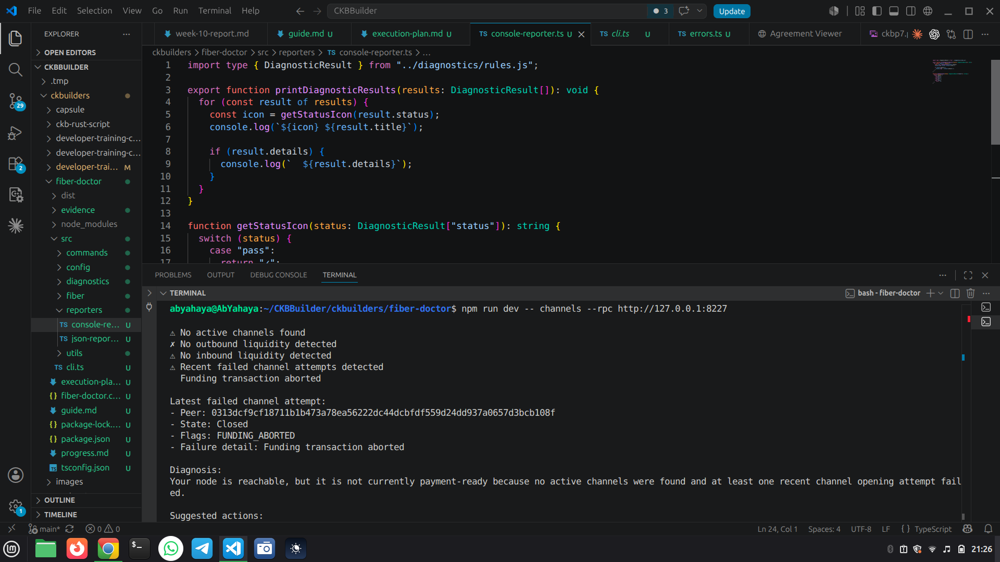
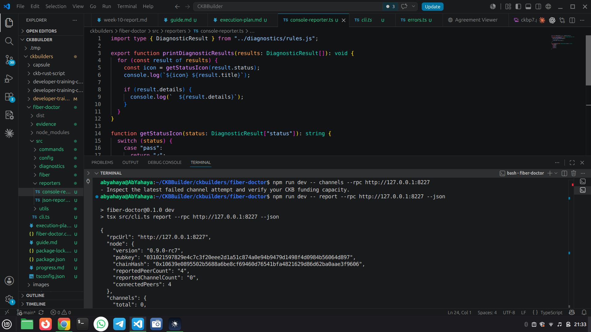

## Week 11 — Fiber Doctor Web UI + Backend Integration

### Courses / Lessons Completed

* None this week

---

### Key Topics Covered

#### Next.js Web UI

* Built a browser-based Fiber Doctor interface in Next.js
* Added a landing page with four tabs that mirror the CLI: Check, Channels, Report, and Explain
* Styled the UI as a judge-friendly dashboard rather than a plain admin page

#### Embedded Backend Routes

* Added Next.js API routes for the same four diagnostics
* Reused the shared Fiber Doctor diagnostic logic instead of duplicating it in the UI
* Kept the backend small so the web app and API can be deployed together

#### Fixture Mode + Presets

* Added saved fixture samples for node, channel, report, and explain flows
* Added preset selection so judges can load examples without pasting JSON manually
* Separated fixture mode from live mode so the UI behavior is clear

#### Live Mode Safety

* Ensured live mode uses the configured Fiber RPC endpoint rather than the saved fixtures
* Made presets fixture-only so they do not mislead users during live testing
* Made Explain a manual classifier for pasted error text or JSON responses

---

### Practical Work Completed

* Created the Next.js app under `fiber-doctor/web`
* Added shared types and API client helpers for the UI
* Added route handlers for:

  * `check`
  * `channels`
  * `report`
  * `explain`

* Added fixture presets and sample data for the judge workflow
* Added visual status banners for fixture mode and live mode
* Verified the UI build succeeds with `npm run build`

---

### Issues Encountered (Why They Came Up)

* **Module resolution between the UI and the CLI sources**: the Next.js app needed explicit resolver support so it could reuse the shared TypeScript code from the CLI side cleanly.
* **Mode confusion in the UI**: the first pass made presets look too active in live mode, so the interface was tightened to make fixture-only controls and manual Explain input clearer.
* **Explain fallback behavior**: an empty Explain input produced an `Unknown error`, which exposed that Explain is a classifier, not a live RPC lookup.

---

### Progress Status

* Web UI is implemented and build-verified
* Backend routes are integrated into the Next.js app
* Fixture mode and live mode are separated clearly
* Preset-based judge testing is ready

---

### Key Learnings

* A small backend inside the Next.js app is enough to keep the UI and diagnostics aligned
* Fixture mode is the safest path for demo and judge workflows
* Explain should be treated as manual input classification, not a live node call

---

### Next

* Finalize the documentation for the web deployment and demo flow
* Prepare the project for Vercel hosting
* Keep the CLI and web output aligned as additional diagnostics are added

---

## 📸 Reference Images

