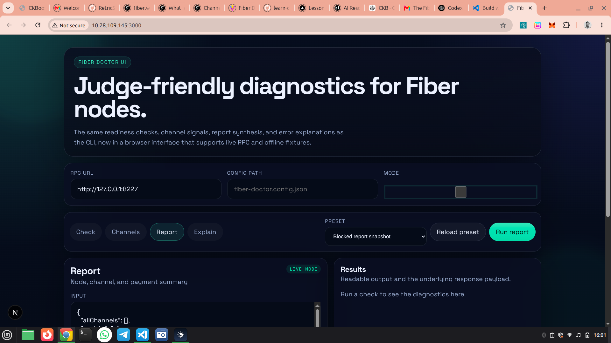

## Week 12 — Fiber Doctor Documentation, Deployment, and Submission Prep

### Courses / Lessons Completed

* None this week

---

### Key Topics Covered

#### Documentation Refresh

* Rewrote the main `README.md` to explain both the CLI and the Next.js UI
* Added deployment notes for hosting the web UI on Vercel
* Documented the difference between fixture mode and live mode

#### Demo Guide

* Expanded the demo guide into a judge-ready walkthrough
* Added a clear test plan for Check, Channels, Report, and Explain in the web UI
* Documented both fixture-based testing and live testing against a Fiber RPC endpoint

#### Submission Preparation

* Cleaned up the repository layout for a separate Fiber Doctor repo push
* Added a project-local `.gitignore` so only the README markdown remains intended for GitHub submission
* Clarified GitHub remote setup and push flow for the standalone repo

#### Workflow Clarification

* Documented the current functionality in concise submission-ready language
* Added notes on infrastructure relevance, user flows, developer flows, and future expansion
* Tightened wording so the project description is direct and not speculative

---

### Practical Work Completed

* Replaced the README with a comprehensive project guide
* Replaced the demo script with a Vercel-first demo runbook
* Added deployment guidance for the Next.js web UI
* Updated the UI wording so Explain is clearly manual input only
* Tightened the UI controls so presets are fixture-only and not misleading in live mode
* Confirmed the Next.js build still succeeds after the documentation and UI changes

---

### Issues Encountered (Why They Came Up)

* **Git push without a remote**: the project had been initialized locally, but no GitHub remote was configured yet.
* **Markdown clutter in the standalone repo**: the repo needed a local ignore rule so the GitHub push would keep the README as the only markdown file.
* **Local Fiber node lock file conflict**: the testnet node was already running in one session, so starting a second instance produced a lock-file error.
* **Vercel deployment constraints**: the web app can be hosted on Vercel, but live RPC only works when the Fiber endpoint is publicly reachable from the deployed backend.

---

### Progress Status

* Documentation is complete for submission and demo use
* Web deployment guidance is in place
* The project is prepared for pushing as a separate GitHub repository
* The UI build remains verified after the final cleanup

---

### Key Learnings

* Submission docs should explain the project clearly for both judges and reviewers
* The best demo path is fixture mode first, live mode second
* A small embedded backend inside Next.js is enough for this project’s web deployment model

---

### Next

* Push the standalone Fiber Doctor repo to GitHub
* Deploy the `web/` folder to Vercel
* Use the web UI fixture flow for the hackathon submission demo

---

## 📸 Reference Images

