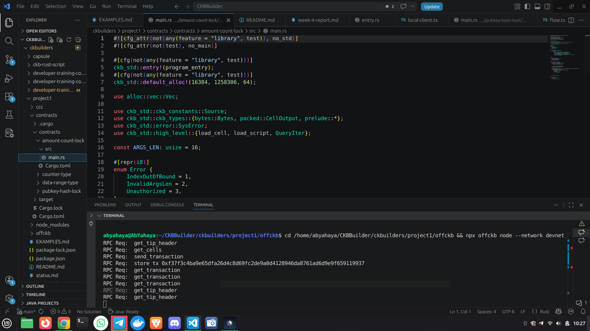
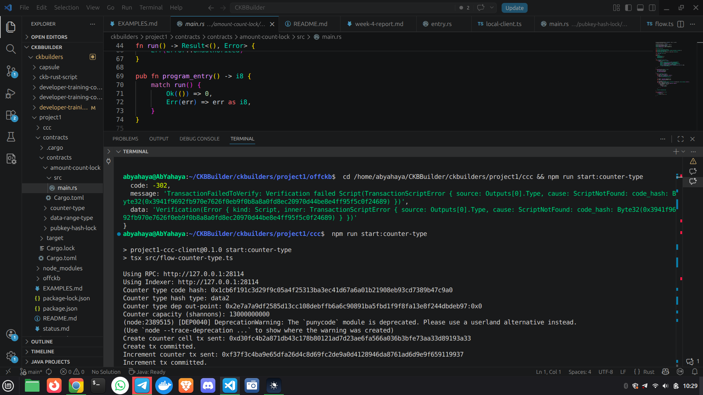

## Week 5 — L1 Course Completion, Capsule Practice, and CCC/offckb Migration

### Courses / Lessons Completed

* **L1 Developer Course — Completed**
* **Capsule Workflow (Practical Usage)**
* **Course Practical Examples and Labs**

---

### Key Topics Covered

#### L1 Course Completion

* Completed the remaining L1 course modules
* Consolidated understanding of CKB transaction and scripting flow across the full course

#### Capsule Development Workflow

* Used Capsule to structure and build smart contract projects
* Reinforced how on-chain Rust contracts are organized, compiled, and prepared for deployment
* Practiced contract lifecycle from code to deployment artifacts

#### Practical Examples and Labs

* Followed practical examples from the course
* Completed associated lab exercises for stronger hands-on understanding
* Compared theory with implementation details in real scripts and transactions

#### Lumos Challenges and Tooling Decision

* Encountered practical issues while using Lumos during the coursework
* Set up an alternative development path using **offckb + CCC** for smoother execution and debugging
* Used the new setup to continue course-aligned implementation and experimentation

#### End-to-End Development with offckb + CCC

* Used offckb for local devnet workflow and contract deployment
* Used CCC for off-chain transaction building and script interaction
* Improved confidence in integrating on-chain contracts with off-chain transaction logic

---

### Practical Work Completed

* Completed the L1 course practical path
* Worked through course examples and labs using Capsule-based workflows
* Built and tested **four mini applications** successfully with the new offckb + CCC setup:

  * Hashlock custom lock flow
  * Amount-count lock flow
  * Data-range type script flow
  * Counter type script flow

* Verified successful execution through deployed contracts and committed transactions on local devnet

---

### Progress Status

* L1 Course: Completed
* Capsule Practical Usage: Completed
* Course Examples and Labs: Completed
* offckb + CCC Local Workflow: Completed and Operational
* Four Mini Applications: Implemented and Successfully Tested

---

### Key Learnings

* Strengthened practical understanding of CKB by implementing full end-to-end flows, not only reading theory
* Learned to adapt tooling when blocked, moving from Lumos issues to a working offckb + CCC path
* Improved ability to debug deployment/configuration issues across contract and client layers
* Gained better intuition for how lock/type script rules map directly to transaction structure and witness/data handling
* Built stronger confidence in iterating quickly through build, deploy, run, and verify cycles

---

### Next

* Continue expanding mini applications with negative/failure-path tests
* Add browser-based UI flows for selected examples while keeping the same contract logic
* Deepen understanding of production-ready off-chain patterns (wallet integration, signing UX, and safer config handling)

---

## 📸 Reference Images

