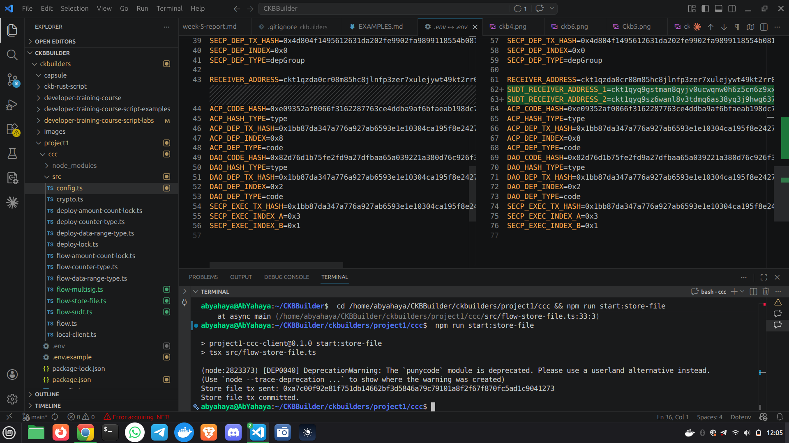
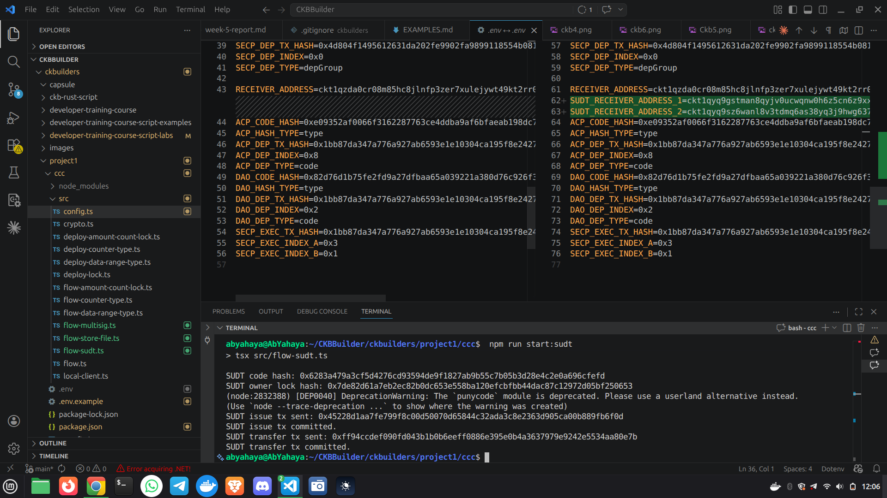

## Week 6 — Light Activity, SUDT + Multisig Labs

### Courses / Lessons Completed

* **SUDT Lab (Token Issue + Transfer)**
* **2-of-3 Multisig Lab (Create + Consume)**
* **Store-a-File Lab (Cell Data Storage)**

---

### Key Topics Covered

#### SUDT Flow

* Used system SUDT script on devnet
* Issued tokens to multiple outputs and transferred to two receivers
* Encoded token amounts as u128 little-endian data

#### Multisig Flow

* Built multisig script args from 3 addresses
* Created a 2-of-3 multisig-locked cell
* Consumed multisig cell using 2 signatures and correct witness format

#### Store-a-File

* Stored a small file (HelloNervos.txt) in cell data
* Calculated occupied capacity based on data size

---

### Practical Work Completed

* Implemented new CCC flows in project1 for:

  * Store-a-File cell data flow
  * SUDT issue + transfer flow
  * 2-of-3 multisig create + consume flow

* Verified transactions on local offckb devnet:

  * Store-a-File tx: 0xa7c00f92e81f751db14662bf3d5846a79c79101a8f2f67f870fc5ad1c9041273
  * SUDT issue tx: 0x45228d1aa7fe799f8c00d50070d65844c32ada3c8e2363d905ca00b889fb6f0d
  * SUDT transfer tx: 0xff94ccdef090fd043b1b0b6eeff0886e395e0b4a3637979e9242e5534aa80e7b
  * Multisig create tx: 0xb575296a293df253dd4645893c983cfb62597b3f50f0785448cc9b495644a867
  * Multisig consume tx: 0x61fe1e33294a07a371e1b696576e99a10f74ce376a2be2b54e9adb2e8f42b0d3

---

### Progress Status

* Labs Completed: SUDT, Multisig, Store-a-File
* offckb + CCC Workflow: Verified for all three flows

---

### Key Learnings

* Reinforced how token amounts and witnesses are encoded in on-chain data
* Improved understanding of multisig lock configuration and signature ordering
* Practiced capacity planning for data-bearing cells

---

### Next

* Add basic negative tests for each new flow
* Start drafting a lightweight UI for one of the new labs

---

## 📸 Reference Images

