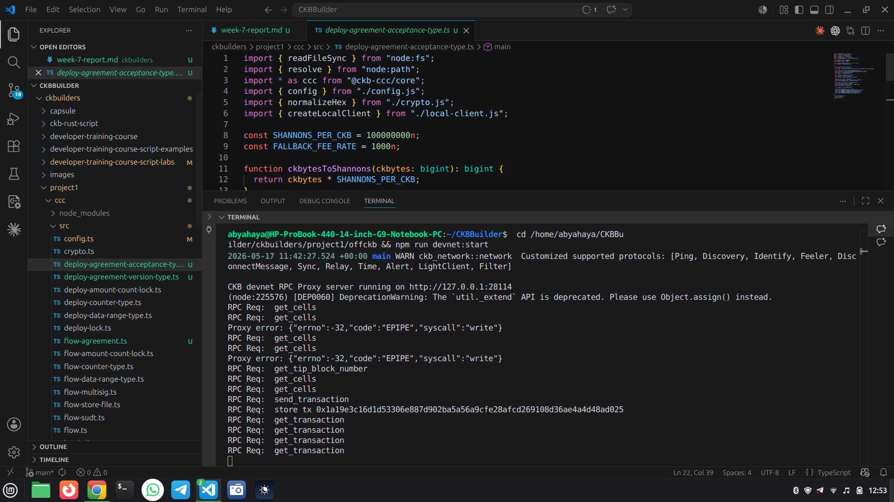
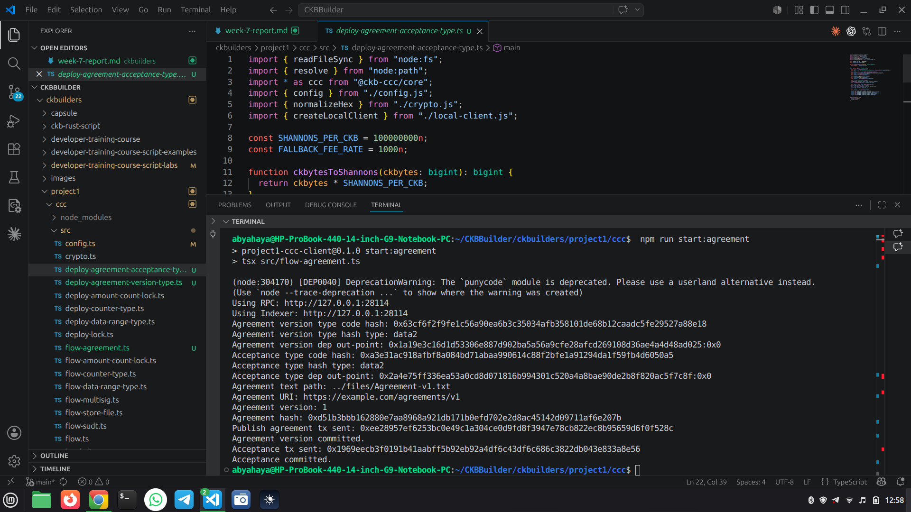

## Week 7 — Agreement Registry MVP

### Courses / Lessons Completed

* None this week

---

### Key Topics Covered

#### Agreement Registry Design

* Versioned agreements stored off-chain with on-chain hash commitments
* Separate acceptance cells that reference agreement versions
* Immutable audit trail for what users accepted

#### Data Model

* Agreement version data: agreement_hash + version + uri_hash
* Acceptance data: agreement_hash + version
* Cell dep validation to bind acceptance to a published agreement version

---

### Practical Work Completed

* Implemented agreement version type script (create-only, validates data length and non-zero version)
* Implemented acceptance type script (create-only, requires matching agreement dep data)
* Added CCC flow to publish agreement version and create acceptance
* Added CCC deploy helpers for both new contracts
* Added a sample agreement text file
* Deployed both contracts on devnet and updated env metadata
* Ran end-to-end flow on devnet:

	* Agreement publish tx: 0xee28957ef6253bc0e49c1a304ce0d9fd8f3947e78cb822ec8b95659d6f0f528c
	* Acceptance tx: 0x1969eecb3f0191b41aabff5b92eb92a4df6c43df6c686c3822db043e833a8e56

---

### Progress Status

* Agreement MVP scaffolded and verified end-to-end on devnet

---

### Key Learnings

* How to structure on-chain data for versioned agreements
* How to bind acceptance cells to a specific agreement using cell deps
* How to split responsibilities between on-chain validation and off-chain storage

---

### Next

* Add version chaining to link successive agreement versions
* Add a simple viewer endpoint that surfaces agreement text + tx hash
* Explore batching acceptance submissions

---

## 📸 Reference Images

