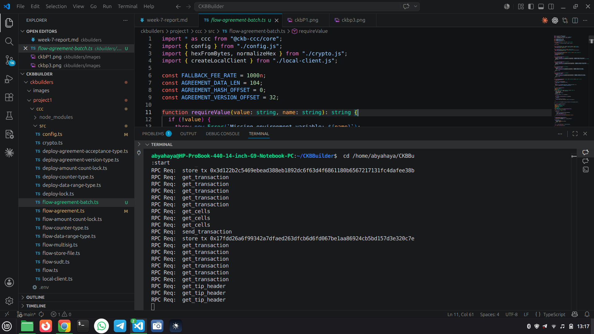
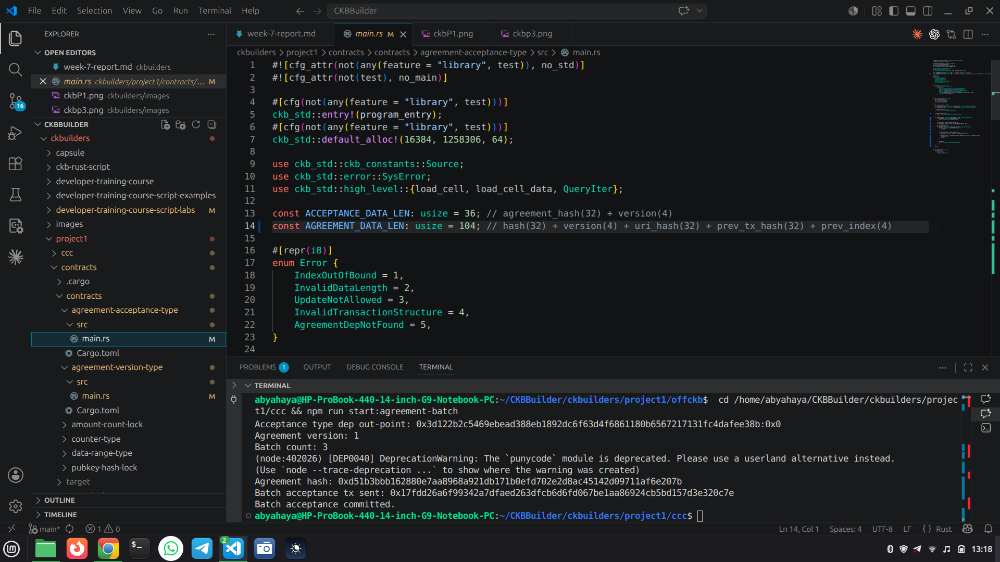
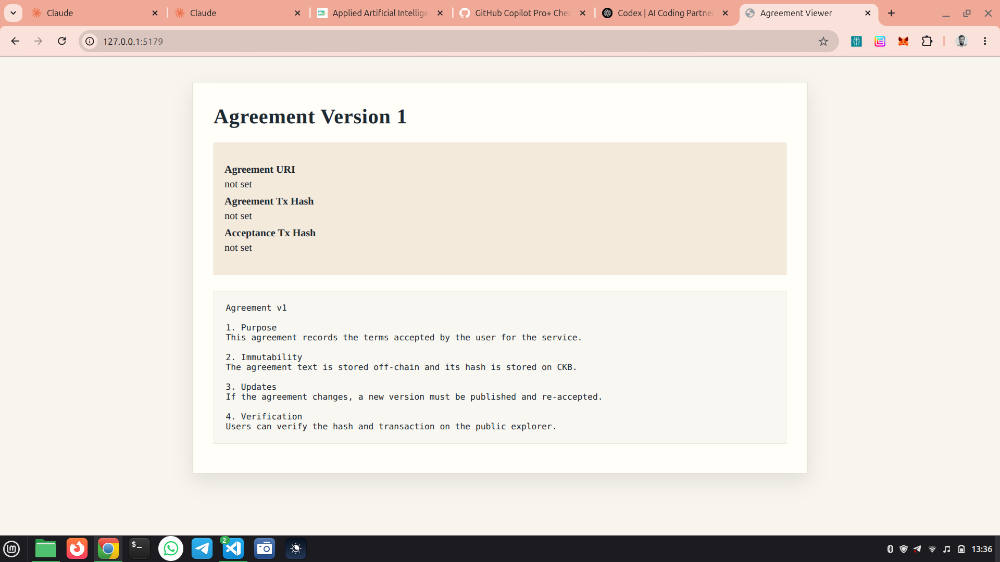

## Week 8 — Agreement Registry MVP (Chaining + Viewer + Batching)

### Courses / Lessons Completed

* None this week

---

### Key Topics Covered

#### Version Chaining

* Extended agreement data layout to include previous version outpoint
* Added validation rules for version 1 vs later versions

#### Viewer + UX Traceability

* Simple viewer endpoint renders agreement text and tx hashes
* Env-driven metadata so the page can show latest version info

#### Batch Acceptance

* Acceptance script updated to validate multiple outputs in one transaction
* CCC batch flow added to submit many acceptance outputs at once

---

### Practical Work Completed

* Updated agreement version type script for version chaining
* Updated acceptance type script to validate multiple acceptance outputs
* Added CCC support for previous outpoint fields
* Added CCC batch acceptance flow and config
* Added agreement viewer script in offckb workspace
* Redeployed contracts on devnet and ran flows:

  * Agreement publish tx (v1): 0x693db0dc19700d1911739cf5d53a31866b7b6488d5b182d05e43fd217e18bab2
  * Acceptance tx (single): 0x6624393cb29537ca71695ef3648a227cf7ee56d997024ff5d3c2543beca1b482
  * Acceptance tx (batch, 3 outputs): 0x17fdd26a6f99342a7dfaed263dfcb6d6fd067be1aa86924cb5bd157d3e320c7e

---

### Progress Status

* Version chaining, viewer, and batching are implemented and verified on devnet

---

### Key Learnings

* How to link agreement versions using outpoints
* How to validate multiple acceptance outputs in a single transaction
* How to build a minimal off-chain viewer for on-chain commitments

---

### Next

* Publish v2 agreement using prev outpoint to validate chaining
* Add viewer improvements (version selector, explorer links)
* Extend batching logic for per-user metadata

---

## 📸 Reference Images

